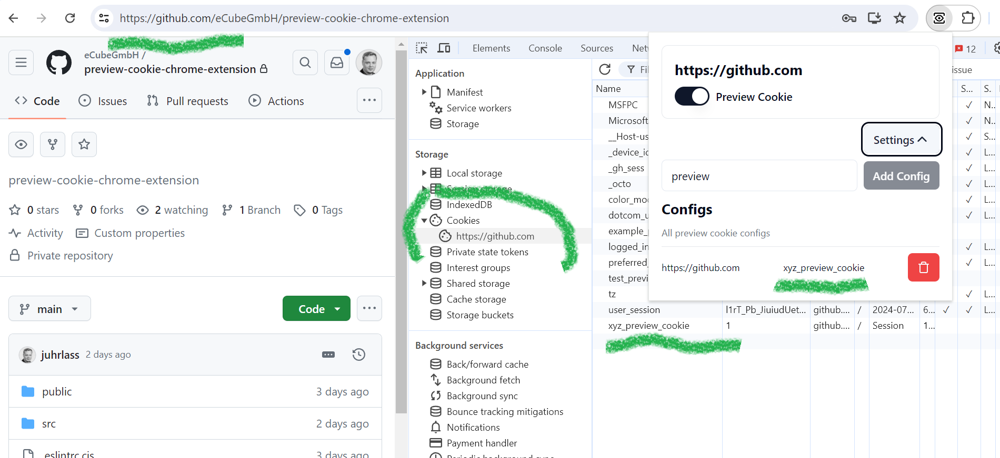
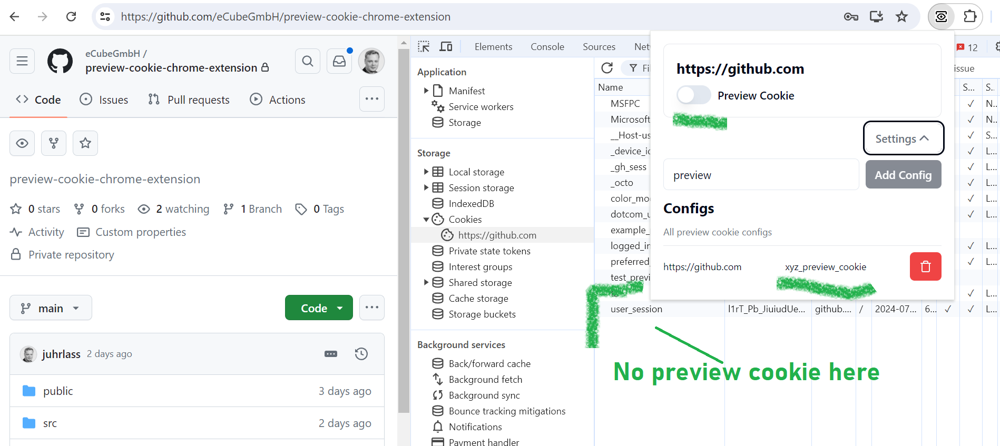

# Preview Cookie – Chrome Extension

A tiny Chrome extension that lets you quickly set or remove a "preview" (or any other purpose) cookie for a website. This makes it easy to switch between a preview/development mode and the default mode, or to force specific behavior on a site.

## Screenshots

Preview Cookie "On"

Preview Cookie "Off"

## Installation & Build

Requirements: Node.js and pnpm installed.

1. Clone the repository
2. Install dependencies: pnpm install
3. Create a build: pnpm build (output goes to dist)

Install in Chrome (Load unpacked):

1. Open chrome://extensions/ in Chrome
2. Enable "Developer mode" in the top right
3. Click "Load unpacked" and select the dist folder
4. Select the extension in the Extensions popup (the jigsaw icon) and optionally pin it to the toolbar

## Usage

1. Navigate to the desired website
2. Click the "Preview Cookie" icon and open "Settings"
3. Enter the name of the cookie to be set and click "Add config"

You can now toggle the configured cookies on and off.
- Switch ON: The cookie with the given name is set. You can choose the ON value per config: either "1" or "true".
- Switch OFF: You can choose what happens per config:
  - remove the cookie (default)
  - set the cookie value to "0"
  - set the cookie value to "false"
- You can configure multiple cookies per host/origin. Each config appears as its own switch.
- You can add multiple site configurations for different domains/origins.

## Development

- Useful scripts:
  - pnpm build builds the extension (type check + Vite build)
  - pnpm dev starts Vite in dev mode (useful for UI development); for the actual extension, keep loading the dist folder in Chrome.
- Tip: While working on the extension, after each build click "Reload" in chrome://extensions/ to apply changes.

## Permissions & Privacy

The extension requires the following Chrome permissions (see public/manifest.json):
- cookies, storage, scripting, tabs, activeTab
- Host permissions: <all_urls> (to set/delete cookies on the currently opened sites)

Note: No data is sent to third-party servers. Settings are stored locally in the browser (chrome.storage).

## Troubleshooting & Feedback

If something doesn't work:
- Check that the correct host/origin is configured (same domain/scheme as the open page)
- Verify whether existing cookies may override the behavior
- Reload the page and/or the extension

Feedback and suggestions are welcome!
